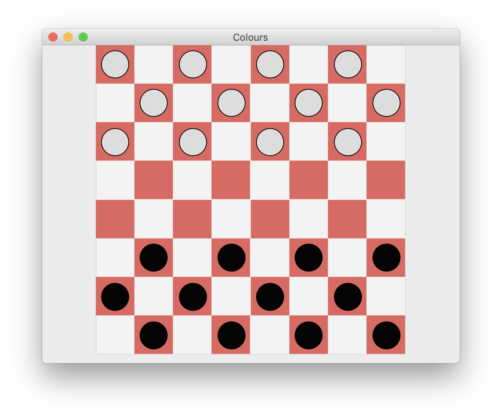
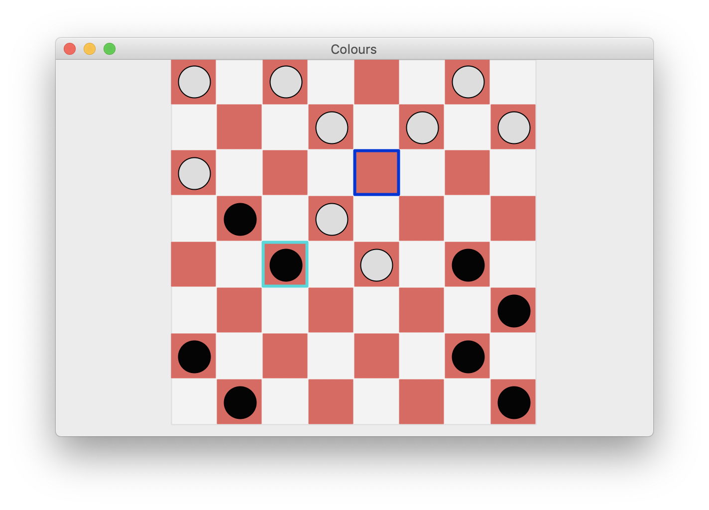
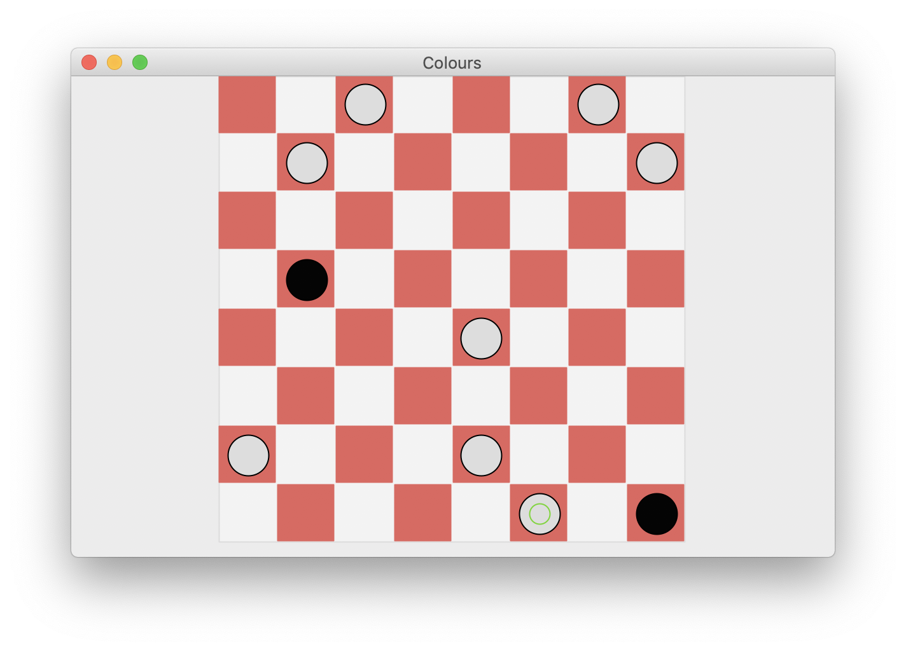
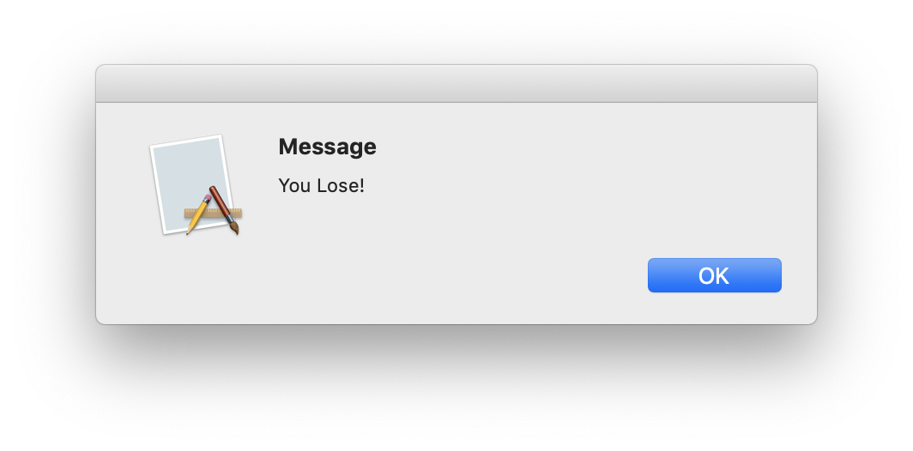

# CS572 Lab2 & Yuepei Li

## Platform

1. ElementoryOS + python37 + wxPython (graphics)
2. MacOS + python37 + wxPython (graphics)

```sh
# mac os
(py37Game) ➜  Lab2 git:(master) ✗ uname -a
Darwin yuepeidembp.student.iastate.edu 18.7.0 Darwin Kernel Version 18.7.0: Tue Aug 20 16:57:14 PDT 2019; root:xnu-4903.271.2~2/RELEASE_X86_64 x86_64

# conda (python)
numpy + wxpython
```

## How to run

```sh
# mac os
cd Lab2
pythonw board.py
```

```sh
# ElementoryOS
cd Lab2
python board.py
```

## Implementation

I set depth to depth=4 due to the trade of complexity and performance.

### Heuristic Evaluation Function

Generally, the function has two principles:
1. The more pieces a player have, the higher score s/he has.
2. The closer a man from the king position (opposite side), the higher score it is.

Here is the python code shows the Heuristic Evaluation Function.

```python
def eval_fn(self, state):
    # print(state)
    board = state.board
    X = []
    O = []
    XK = []
    OK = []
    for pos, piece in board.items():
        if piece == "X":
            X.append(pos)
        elif piece == "O":
            O.append(pos)
        elif piece == "OK":
            OK.append(pos)
        elif piece == "XK":
            XK.append(pos)
    # distance to opposite side
    valueX = 0
    valueO = 0
    for i in X:
        valueX += 1/(8-i[0])
    for i in O:
        valueO += 1/(8-i[0])
    value_distance = valueX - valueO

    # number of pieces
    value_number = (len(X) - len(O) + 5*len(XK) - 5*len(OK)) / 10

    value = value_number + value_distance
    # print(value)
    return value
```

## Performance

- Initialization


- Show valid ways for users

- Man change to King

- Win/Lose



## Reference

I take the advantage of [online repository](https://github.com/liyp0095/aima-python). I import one class and two functions from it.

```python
from aima_python.games import Game, GameState, alphabeta_search, alphabeta_cutoff_search
```

## questions

- [ ] moving pieces gif
- [ ] time consuming (depth=6 cost several seconds for each step)
