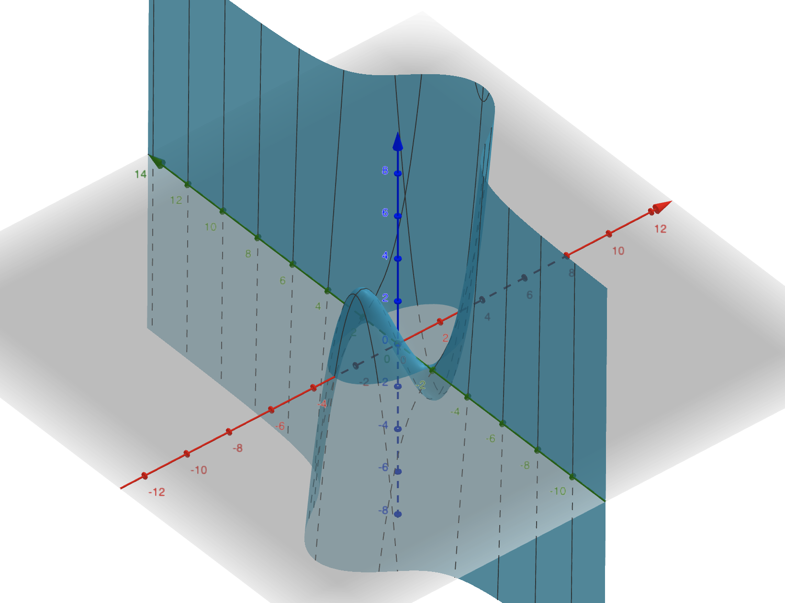

# CS577 Assignment9 by Yuepei Li

## Platform

python 3.7

## How to run

```shell
# change the initial value of x1,x2 in main function.
python main.py  

```

## Result

```sh
# sample result 1
(base) ➜  Assignment9 git:(master) ✗ python main.py
================= minima ==================
starts at (0.000000, 0.000000)
1 th iteration:
 * t: 0.5774
 * position: (1.7321, 0.0)
 * f_value: -3.4641
 * accuracy: 3.4641
2 th iteration:
 * t: 0.0
 * position: (1.7321, 0.0)
 * f_value: -3.4641
 * accuracy: 0.0
================= maxima ==================
starts at (0.000000, 0.000000)
1 th iteration:
 * t: -0.5774
 * position: (-1.7321, 0.0)
 * f_value: 3.4641
 * accuracy: -3.4641
2 th iteration:
 * t: 0.0
 * position: (-1.7321, 0.0)
 * f_value: 3.4641
 * accuracy: 0.0

# sample result 2
(base) ➜  Assignment9 git:(master) ✗ python main.py
================= minima ==================
starts at (1.000000, 1.000000)
1 th iteration:
 * t: 0.548
 * position: (1.548, -0.096)
 * f_value: -3.3932
 * accuracy: 1.7266
2 th iteration:
 * t: 0.3123
 * position: (1.7336, -0.0032)
 * f_value: -3.4641
 * accuracy: 0.0708
3 th iteration:
 * t: 0.2883
 * position: (1.732, -0.0)
 * f_value: -3.4641
 * accuracy: 0.0
4 th iteration:
 * t: 0.2887
 * position: (1.7321, -0.0)
 * f_value: -3.4641
 * accuracy: 0.0
================= maxima ==================
starts at (1.000000, 1.000000)
1 th iteration:
 * t: -0.7018
 * position: (0.2982, 2.4037)
 * f_value: 0.837
 * accuracy: -2.5037
2 th iteration:
 * t: 0.7924
 * position: (-1.9735, 1.2679)
 * f_value: 0.186
 * accuracy: 0.651
3 th iteration:
 * t: -0.2201
 * position: (-1.4228, 0.1666)
 * f_value: 3.2689
 * accuracy: -3.0828
4 th iteration:
 * t: -0.3313
 * position: (-1.7368, 0.0096)
 * f_value: 3.4639
 * accuracy: -0.195
5 th iteration:
 * t: -0.2876
 * position: (-1.732, 0.0)
 * f_value: 3.4641
 * accuracy: -0.0002
6 th iteration:
 * t: -0.2887
 * position: (-1.7321, 0.0)
 * f_value: 3.4641
 * accuracy: -0.0
```

## Problem

- [ ] In some cases, no real root for quadratic equation of t
- [ ] How to choose start position?

## Learn

https://www.geogebra.org/3d?lang=en, this link gives 3d graph


